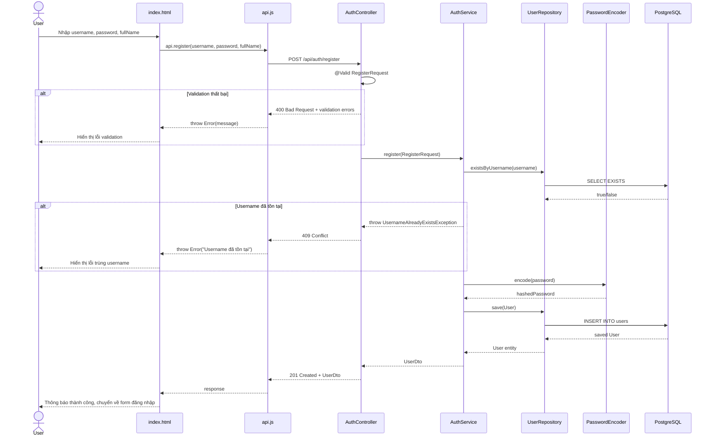

# Thiết kế Kỹ thuật — Đăng ký Tài khoản Member

## Tổng quan

Tính năng cho phép người dùng mới tự đăng ký tài khoản Member thông qua endpoint công khai `POST /api/auth/register`. Thiết kế tận dụng tối đa các component hiện có (UserRepository, PasswordEncoder, GlobalExceptionHandler, UserDto) và chỉ thêm đúng những gì cần thiết: một DTO mới (`RegisterRequest`), một method mới trong `AuthService`, một endpoint mới trong `AuthController`, một custom exception (`UsernameAlreadyExistsException`), và cập nhật frontend.

### Quyết định thiết kế chính

1. **Đặt register trong AuthService thay vì UserService**: Đăng ký là hành động xác thực (authentication flow), không phải quản trị user. Tách biệt rõ ràng: AuthService xử lý register/login, UserService xử lý CRUD user bởi Admin.

2. **Tạo custom exception `UsernameAlreadyExistsException`**: Hệ thống hiện tại dùng `RuntimeException` cho mọi business error → GlobalExceptionHandler bắt tất cả thành HTTP 400. Để trả đúng HTTP 409 Conflict cho username trùng, cần exception riêng với handler riêng. Không sửa handler hiện tại của `RuntimeException` để tránh ảnh hưởng các flow khác.

3. **Không tạo RegisterResponse riêng**: Tái sử dụng `UserDto` hiện có vì response chứa đúng các trường cần thiết (id, username, fullName, role). Không thêm abstraction không cần thiết.

4. **Frontend toggle giữa login/register trên cùng `index.html`**: Giữ đơn giản, không tạo trang mới. Dùng JavaScript show/hide hai form.

## Kiến trúc

### Luồng xử lý đăng ký



### Các component bị ảnh hưởng

| Component | Thay đổi | Mô tả |
|-----------|----------|-------|
| `RegisterRequest` (mới) | Tạo mới | DTO cho request đăng ký với validation annotations |
| `UsernameAlreadyExistsException` (mới) | Tạo mới | Custom exception cho username trùng lặp |
| `AuthController` | Thêm method | Thêm endpoint `POST /api/auth/register` |
| `AuthService` | Thêm method | Thêm method `register(RegisterRequest)` |
| `GlobalExceptionHandler` | Thêm handler | Thêm handler cho `UsernameAlreadyExistsException` → 409 |
| `SecurityConfig` | Không thay đổi | `/api/auth/**` đã permitAll sẵn |
| `index.html` | Cập nhật | Thêm form đăng ký, toggle login/register |
| `api.js` | Thêm method | Thêm `api.register()` |

## Components và Interfaces

### RegisterRequest DTO

```java
// src/main/java/com/center/waterorder/dto/RegisterRequest.java
@Data
@NoArgsConstructor
@AllArgsConstructor
public class RegisterRequest {
    
    @NotBlank(message = "Username không được để trống")
    @Size(max = 50, message = "Username không được vượt quá 50 ký tự")
    private String username;
    
    @NotBlank(message = "Mật khẩu không được để trống")
    @Size(min = 8, message = "Mật khẩu phải có ít nhất 8 ký tự")
    private String password;
    
    @NotBlank(message = "Họ tên không được để trống")
    private String fullName;
}
```

### UsernameAlreadyExistsException

```java
// src/main/java/com/center/waterorder/exception/UsernameAlreadyExistsException.java
public class UsernameAlreadyExistsException extends RuntimeException {
    public UsernameAlreadyExistsException(String message) {
        super(message);
    }
}
```

### AuthController — Endpoint mới

```java
// Thêm vào AuthController.java
@PostMapping("/register")
public ResponseEntity<UserDto> register(@Valid @RequestBody RegisterRequest request) {
    return ResponseEntity.status(HttpStatus.CREATED)
            .body(authService.register(request));
}
```

### AuthService — Method mới

```java
// Thêm vào AuthService.java
@Transactional
public UserDto register(RegisterRequest request) {
    if (userRepository.existsByUsername(request.getUsername())) {
        throw new UsernameAlreadyExistsException("Username đã tồn tại");
    }
    
    User user = new User();
    user.setUsername(request.getUsername());
    user.setPassword(passwordEncoder.encode(request.getPassword()));
    user.setFullName(request.getFullName());
    user.setRole("MEMBER");
    user.setActive(true);
    
    User saved = userRepository.save(user);
    return toDto(saved);
}

private UserDto toDto(User user) {
    UserDto dto = new UserDto();
    dto.setId(user.getId());
    dto.setUsername(user.getUsername());
    dto.setFullName(user.getFullName());
    dto.setRole(user.getRole());
    dto.setActive(user.getActive());
    dto.setCreatedAt(user.getCreatedAt());
    return dto;
}
```

**Lưu ý**: Method `toDto()` hiện đang nằm trong `UserService`. Để tránh duplicate, có hai lựa chọn:
- **Lựa chọn A**: Duplicate `toDto()` trong `AuthService` (đơn giản, tách biệt rõ ràng)
- **Lựa chọn B**: Extract `toDto()` thành static method trong `UserDto` hoặc utility class

→ **Chọn A** vì: method nhỏ (6 dòng), tránh tạo coupling giữa AuthService và UserService, tuân thủ nguyên tắc Simplicity First.

### GlobalExceptionHandler — Handler mới

```java
// Thêm vào GlobalExceptionHandler.java
@ExceptionHandler(UsernameAlreadyExistsException.class)
public ResponseEntity<Map<String, Object>> handleUsernameAlreadyExists(
        UsernameAlreadyExistsException ex) {
    Map<String, Object> error = new HashMap<>();
    error.put("timestamp", LocalDateTime.now());
    error.put("status", HttpStatus.CONFLICT.value());
    error.put("error", "Conflict");
    error.put("message", ex.getMessage());
    
    return ResponseEntity.status(HttpStatus.CONFLICT).body(error);
}
```

### Frontend — api.js

```javascript
// Thêm vào object api trong api.js
register: (username, password, fullName) =>
    callApi('/auth/register', 'POST', { username, password, fullName }),
```

### Frontend — index.html

Thêm form đăng ký với toggle giữa login/register. Form đăng ký gồm 3 trường: username, password, fullName. Có link "Chưa có tài khoản? Đăng ký" và "Đã có tài khoản? Đăng nhập" để chuyển đổi.

## Data Models

### Bảng `users` (không thay đổi)

Tính năng đăng ký sử dụng đúng bảng `users` hiện có, không cần migration.

| Column | Type | Constraints | Ghi chú |
|--------|------|-------------|---------|
| id | BIGSERIAL | PK, auto-increment | |
| username | VARCHAR(50) | NOT NULL, UNIQUE | Người dùng tự nhập |
| password | VARCHAR | NOT NULL | BCrypt hash từ password người dùng nhập |
| full_name | VARCHAR(100) | NOT NULL | |
| role | VARCHAR(10) | NOT NULL, DEFAULT 'MEMBER' | Luôn là 'MEMBER' khi đăng ký |
| is_active | BOOLEAN | NOT NULL, DEFAULT true | Luôn true khi đăng ký |
| created_at | TIMESTAMP | NOT NULL | Auto-set bởi `@PrePersist` |

### RegisterRequest DTO

| Field | Type | Validation | Mapping |
|-------|------|------------|---------|
| username | String | @NotBlank, @Size(max=50) | → User.username |
| password | String | @NotBlank, @Size(min=8) | → BCrypt encode → User.password |
| fullName | String | @NotBlank | → User.fullName |

### Response: UserDto (tái sử dụng)

| Field | Type | Ghi chú |
|-------|------|---------|
| id | Long | Auto-generated |
| username | String | Từ request |
| fullName | String | Từ request |
| role | String | Luôn "MEMBER" |
| active | Boolean | Luôn true |
| createdAt | LocalDateTime | Auto-set |


## Correctness Properties

*Một property là đặc tính hoặc hành vi phải đúng trong mọi lần thực thi hợp lệ của hệ thống — về bản chất là một phát biểu hình thức về những gì hệ thống phải làm. Properties đóng vai trò cầu nối giữa đặc tả dễ đọc cho con người và đảm bảo tính đúng đắn có thể kiểm chứng bằng máy.*

### Property 1: Đăng ký bảo toàn input và gán đúng giá trị mặc định

*Với mọi* RegisterRequest hợp lệ (username non-blank max 50 ký tự, password non-blank min 8 ký tự, fullName non-blank), khi gọi register thành công, UserDto trả về phải có: username và fullName khớp với request, role luôn là "MEMBER", active luôn là true, id khác null, và createdAt khác null.

**Validates: Requirements 1.2, 1.4, 1.5, 5.2**

### Property 2: Mật khẩu luôn được hash

*Với mọi* password hợp lệ (min 8 ký tự), sau khi register thành công, password được lưu trong database phải khác plain text gốc VÀ BCrypt.matches(plainPassword, storedHash) phải trả về true.

**Validates: Requirements 1.3, 5.3**

### Property 3: Trường blank bị từ chối

*Với mọi* RegisterRequest mà username hoặc fullName chỉ chứa whitespace (spaces, tabs, newlines, hoặc empty string), hệ thống phải từ chối request và trả về lỗi validation, danh sách user không thay đổi.

**Validates: Requirements 2.1, 2.4**

### Property 4: Mật khẩu quá ngắn bị từ chối

*Với mọi* RegisterRequest có password non-blank nhưng độ dài dưới 8 ký tự, hệ thống phải từ chối request và trả về lỗi validation.

**Validates: Requirements 2.3**

### Property 5: Username quá dài bị từ chối

*Với mọi* RegisterRequest có username non-blank nhưng độ dài vượt quá 50 ký tự, hệ thống phải từ chối request và trả về lỗi validation.

**Validates: Requirements 2.5**

### Property 6: Username trùng lặp trả về conflict

*Với mọi* RegisterRequest hợp lệ, nếu đăng ký lần đầu thành công, thì đăng ký lần hai với cùng username (bất kể password và fullName) phải thất bại với UsernameAlreadyExistsException.

**Validates: Requirements 3.1, 3.2**

## Xử lý Lỗi

### Bảng Error Handling

| Scenario | Exception | HTTP Status | Message | Handler |
|----------|-----------|-------------|---------|---------|
| Username/password/fullName blank | `MethodArgumentNotValidException` | 400 Bad Request | Field-specific validation message | `GlobalExceptionHandler.handleValidationException()` (hiện có) |
| Password < 8 ký tự | `MethodArgumentNotValidException` | 400 Bad Request | "Mật khẩu phải có ít nhất 8 ký tự" | `GlobalExceptionHandler.handleValidationException()` (hiện có) |
| Username > 50 ký tự | `MethodArgumentNotValidException` | 400 Bad Request | "Username không được vượt quá 50 ký tự" | `GlobalExceptionHandler.handleValidationException()` (hiện có) |
| Username đã tồn tại | `UsernameAlreadyExistsException` | 409 Conflict | "Username đã tồn tại" | `GlobalExceptionHandler.handleUsernameAlreadyExists()` (mới) |
| Lỗi hệ thống không mong đợi | `Exception` | 500 Internal Server Error | "An unexpected error occurred" | `GlobalExceptionHandler.handleGenericException()` (hiện có) |

### Quyết định thiết kế Error Handling

**Tại sao tạo `UsernameAlreadyExistsException` thay vì dùng `RuntimeException`?**

Handler hiện tại cho `RuntimeException` trả về HTTP 400. Nếu throw `RuntimeException("Username đã tồn tại")`, client nhận 400 thay vì 409 — sai semantic. Tạo exception riêng cho phép:
- Trả đúng HTTP 409 Conflict
- Không ảnh hưởng các flow khác đang dùng `RuntimeException` → 400
- Frontend có thể phân biệt lỗi validation (400) và lỗi trùng lặp (409)

**Handler ordering**: `UsernameAlreadyExistsException` extends `RuntimeException`, nhưng Spring chọn handler cụ thể nhất trước. Handler cho `UsernameAlreadyExistsException` sẽ được ưu tiên hơn handler cho `RuntimeException`.

### Response Format

Tất cả error response tuân theo format hiện có:

```json
{
    "timestamp": "2024-01-15T10:30:00",
    "status": 409,
    "error": "Conflict",
    "message": "Username đã tồn tại"
}
```

## Chiến lược Testing

### Tổng quan

Áp dụng dual testing approach: unit tests cho specific examples và edge cases, property-based tests cho universal properties. Sử dụng jqwik (đã có trong pom.xml) cho property-based testing.

### Property-Based Tests (jqwik)

Mỗi property test chạy tối thiểu 100 iterations. Mỗi test có comment tham chiếu property trong design.

| Property | Test Class | Mô tả | Validates |
|----------|-----------|-------|-----------|
| Property 1 | `AuthServicePropertyTest` | Generate random valid RegisterRequest, verify UserDto output | Req 1.2, 1.4, 1.5, 5.2 |
| Property 2 | `AuthServicePropertyTest` | Generate random password ≥8 chars, verify BCrypt hash | Req 1.3, 5.3 |
| Property 3 | `AuthServicePropertyTest` | Generate whitespace-only strings cho username/fullName, verify rejection | Req 2.1, 2.4 |
| Property 4 | `AuthServicePropertyTest` | Generate random strings length 1-7, verify rejection | Req 2.3 |
| Property 5 | `AuthServicePropertyTest` | Generate random strings length 51+, verify rejection | Req 2.5 |
| Property 6 | `AuthServicePropertyTest` | Generate random valid request, register twice, verify second fails | Req 3.1, 3.2 |

**Tag format**: `// Feature: member-registration, Property {N}: {title}`

### Unit Tests (JUnit 5 + Mockito)

| Test | Test Class | Mô tả |
|------|-----------|-------|
| Đăng ký thành công | `AuthServiceTest` | Happy path với mock repository |
| Username trùng → exception | `AuthServiceTest` | Verify throw UsernameAlreadyExistsException |
| Password được hash | `AuthServiceTest` | Verify passwordEncoder.encode() được gọi |

### Integration Tests (Spring Boot Test)

| Test | Test Class | Mô tả |
|------|-----------|-------|
| POST /api/auth/register → 201 | `AuthControllerIntegrationTest` | Full flow với valid request |
| POST /api/auth/register → 400 (validation) | `AuthControllerIntegrationTest` | Blank fields, short password, long username |
| POST /api/auth/register → 409 (duplicate) | `AuthControllerIntegrationTest` | Username đã tồn tại |
| Endpoint không yêu cầu JWT | `AuthControllerIntegrationTest` | Gọi không có token, verify không bị 401 |

### Cấu trúc Test Files

```
src/test/java/com/center/waterorder/
├── service/
│   ├── AuthServiceTest.java              # Unit tests
│   └── AuthServicePropertyTest.java      # Property-based tests (jqwik)
└── controller/
    └── AuthControllerIntegrationTest.java # Integration tests
```
